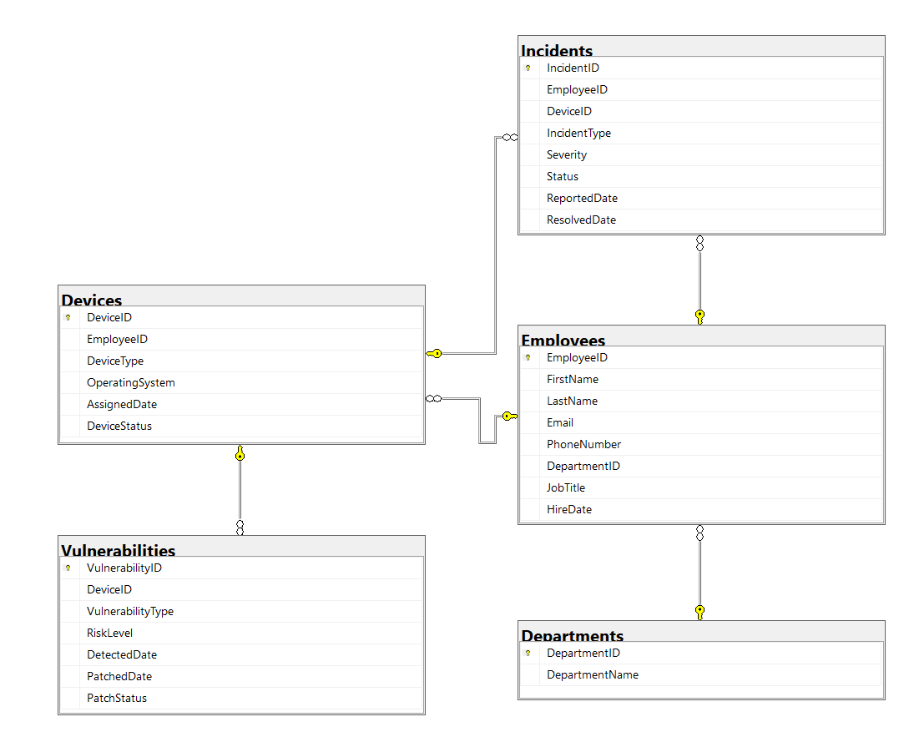

# CyberSecurityAnalytics

## Project Overview

For this project, I created a simulated consulting firm, Northbridge Consulting, whose data represents its different departments, employees, and company devices. To make the environment more complete and dynamic, I added security incidents and vulnerabilities associated with those devices.

The purpose of the project was to create a realistic enough environment to analyze where security issues are concentrated, how vulnerabilities are being managed, and how security activity differs across the organization.

The database was intentionally designed to remain relatively simple while providing enough interconnected data to perform more complex SQL analysis.

## Database Design

The database consists of five main tables: Departments, Employees, Devices, Incidents, and Vulnerabilities.

The organization is divided into five typical consulting departments and contains 270 employees. Each employee belongs to a department and is assigned company devices. Every employee has a laptop and a mobile device, while tablets are assigned only to selected senior roles. Device information also includes the operating system, assignment date, and current device status.

Security incidents are linked to both employees and devices and include information such as incident type, severity, status, reporting date, and resolution date. Vulnerabilities are linked to devices and contain their vulnerability type, risk level, detection date, patch status, and patch date.

Primary and foreign keys connect the tables and maintain the relationships between departments, employees, devices, incidents, and vulnerabilities.

### Entity Relationship Diagram

## Data Generation

The project uses a synthetic dataset created specifically for the database. SQL scripts were used to populate the environment with:

- 270 employees
- 587 devices
- 200 security incidents
- 300 vulnerabilities

Rather than generating completely independent values, I introduced rules between related fields to make the dataset more coherent. For example, every employee receives a laptop and mobile device, tablets are restricted to selected senior positions, unresolved incidents do not have a resolution date, and vulnerabilities only have a patch date when their status is marked as patched.

AI-assisted generation was used to help create the synthetic data while the database structure, relationships, generation rules, SQL analysis, and validation were developed as part of the project.

## Security Analysis

The analysis consists of 20 SQL queries designed to explore the simulated security environment from different perspectives.

It begins with an overview of the dataset and then the distribution of employees and devices, incident frequency and severity, open and critical incidents, vulnerability exposure, patching activity, resolution times, differences between departments, and monthly incident trends.

The queries progress from basic filtering and aggregation to multi-table analysis using joins, CTEs, subqueries, conditional aggregation, and window functions. This made it possible to combine information across the database and compare security indicators at both department and company level.

The complete analysis is available in '07_AnalysisQueries.sql'.

## Stored Procedure

'GetDepartmentData' provides a reusable department-level security summary. The procedure accepts a department name as a parameter and returns its number of employees and devices, total and critical incidents, open incidents, total and critical vulnerabilities, pending vulnerabilities, and patch rate.

Example:

EXEC GetDepartmentData
    @DepartmentName = 'Consulting';

The procedure uses aggregation across multiple related tables while preventing duplicated records caused by one-to-many joins.

## Key Findings

Analysis of the dataset highlighted several differences across the organization:

- Consulting recorded the highest overall number of security incidents and the highest number of critical incidents.
- The company-wide vulnerability patch rate was approximately 81.67%, although patching performance varied between departments.
- Department patch rates ranged from approximately 73% to 89%, showing a noticeable difference in vulnerability remediation across the organization.
- Operating systems, vulnerability risk levels, incident status, and resolution times were analyzed to identify where security activity was concentrated.
- Monthly incident analysis was used to compare changes in reported security incidents over time.

These findings describe patterns within the synthetic dataset and should not be interpreted as evidence about real organizations or the inherent security of particular technologies.